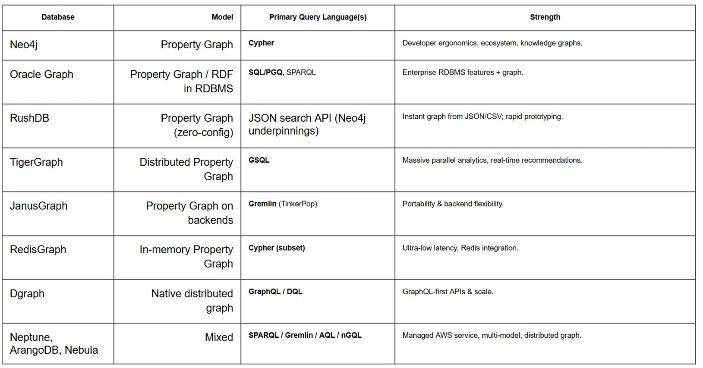

# 🚀 Vidya Astra - Knowledge Toolkit

> **"Vidya Astra: The Toolkit of Knowledge"** - Powerful, scalable knowledge graphs for the modern era



---

## 🎯 What is Vidya Astra?

**Vidya Astra** is a comprehensive, multi-domain **knowledge graph platform** that harnesses the power of Neo4j and Spring Boot to create intelligent, interconnected knowledge systems. It's designed for organizations that need to:

- 🧠 **Understand Complex Relationships** across multiple domains
- 🔍 **Detect Patterns** and anomalies in connected data
- 🎓 **Learn from Knowledge** through interactive visualizations
- ⚡ **Scale Intelligently** with graph database technology
- 🌍 **Adapt Across Domains** using consistent architecture
- 💡 **Make Better Decisions** based on connected intelligence

### 📖 Etymology: Why "Vidya Astra"?

```
Vidya (विद्या)  =  Knowledge, Wisdom, Learning
Astra (अस्त्र)  =  Tool, Weapon, Instrument
───────────────────────────────────────────────
         ⚔️  "The Weapon of Knowledge"  ⚔️
```

---

## 🏗️ Architecture Overview

Vidya Astra combines **multiple cutting-edge technologies**:

```
┌─────────────────────────────────────────────┐
│         Interactive D3.js Visualizations    │
│    (Real-time Knowledge Graph Exploration)  │
└──────────────────┬──────────────────────────┘
                   │
┌──────────────────▼──────────────────────────┐
│       Spring Boot REST API Layer            │
│   (Domain-Specific Microservices)           │
└──────────────────┬──────────────────────────┘
                   │
┌──────────────────▼──────────────────────────┐
│     Spring Data Neo4j ORM Layer             │
│   (Object-to-Graph Mapping)                 │
└──────────────────┬──────────────────────────┘
                   │
┌──────────────────▼──────────────────────────┐
│         Neo4j Graph Database                │
│   (Native Graph Storage & Processing)       │
└─────────────────────────────────────────────┘
```

---

## 🗄️ Graph Database Technologies

Choose the right database for your knowledge graph needs:

| Database | Best For | Key Advantage | Use Case |
|----------|----------|---------------|----------|
| **Neo4j** ⭐ | General purpose, developers | Native graphs, Cypher, rich ecosystem | Fraud detection, recommendations |
| **Oracle Graph** | Enterprise RDBMS | Converged DB + graph with SQL/PGQ | Financial systems, compliance |
| **RushDB** | Rapid prototyping | Zero-config, auto-normalization | MVP, AI applications |
| **TigerGraph** | Large-scale analytics | Turing-complete GSQL, parallel processing | Graph algorithms, analytics |
| **Gremlin/JanusGraph** | Multi-backend systems | Universal traversal language | Portable graph solutions |
| **Neptune, ArangoDB** | Specialized needs | GraphQL, multi-model, serverless | Cloud-native applications |

---

## 📦 Domain Modules

### 🏏 Cricket Analytics
**Store and analyze cricket matches, players, teams, and performance statistics**

```
Entities: Teams, Players, Matches, Performance Stats
Relationships: PLAYS_FOR, PLAYED_MATCH, WINNER, SCORED_IN
Use Cases: Player selection, team analysis, performance tracking
```

### 🏥 Healthcare Knowledge
**Medical knowledge graph covering diseases, treatments, medications, and providers**

```
Entities: Diseases, Treatments, Medications, Providers, Patients
Relationships: TREATS, HAS_SYMPTOM, PRESCRIBES, SPECIALIZES_IN
Use Cases: Drug interactions, diagnosis support, treatment recommendations
```

### 🧘 Yoga & Wellness
**Yoga poses, practices, health benefits, and wellness knowledge**

```
Entities: Poses, Practices, Benefits, Body Parts, Instructors
Relationships: TARGETS, BENEFITS, IMPROVES, PRACTICED_BY
Use Cases: Personalized yoga plans, injury prevention, wellness tracking
```

### 🛒 Supermarket & E-Commerce
**Retail knowledge graph with departments, products, brands, and customer preferences**

```
Entities: Products, Departments, Brands, Suppliers, Customers, Promotions
Relationships: IN_DEPARTMENT, MANUFACTURED_BY, PURCHASED_BY, ON_PROMOTION
Use Cases: Product recommendations, inventory management, customer insights
```

### 🚨 Fraud Detection
**Fraud detection and prevention with types, methods, indicators, and prevention strategies**

```
Entities: Fraud Types, Detection Methods, Indicators, Prevention Strategies
Relationships: DETECTS, INDICATES_FRAUD, PREVENTS, HAS_RISK_LEVEL
Use Cases: Fraud ring detection, anomaly detection, risk assessment
```

### 🐦 Bird Migration Ecology
**Knowledge graph on bird species, migration patterns, habitats, and conservation**

```
Entities: Bird Species, Migration Routes, Habitats, Seasons, Stopovers
Relationships: MIGRATES_VIA, HABITATS_IN, ENDANGERED_BY, MONITORED_BY
Use Cases: Conservation tracking, climate impact analysis, ecology research
```

### 🍽️ Recipe & Food Pairing ✨ NEW
**Culinary knowledge graph with recipes, ingredients, cuisines, and dietary requirements**

```
Entities: Recipes, Ingredients, Cuisines, Chefs, Dietary Requirements, Allergens
Relationships: USES_INGREDIENT, PART_OF_CUISINE, CREATED_BY, PAIRS_WITH
Use Cases: Menu planning, allergen warnings, recipe recommendations
Features: 100% vegetarian, ingredient substitutions, cuisine fusion
```

### 🎵 Music Recommendation Network ✨ NEW
**Music knowledge graph with artists, songs, albums, genres, and playlists**

```
Entities: Artists, Songs, Albums, Genres, Producers, Playlists, Users
Relationships: CREATES, FEATURES_IN, PRODUCED_BY, IN_GENRE, IN_PLAYLIST
Use Cases: Music recommendations, collaboration discovery, playlist curation
Features: Genre evolution, artist networks, personalized recommendations
```

---

## 🌐 Live Interactive Demos

Explore Vidya Astra's knowledge graphs in action:

| Demo | Description                                | Link |
|------|--------------------------------------------|------|
| 🏠 **Main Portal** | Interactive introduction to Yours Truly !  | [View Demo](https://vishalmysore.github.io/vidyaastra/graphs/) |
| 🚨 **Fraud Detection** | Real-time fraud pattern visualization      | [View Demo](https://vishalmysore.github.io/vidyaastra/graphs/fraud_detection) |
| 🔍 **Cycle Detection** | Detect fraud rings and circular patterns   | [View Demo](https://vishalmysore.github.io/vidyaastra/graphs/cycle_detection) |
| 🐦 **Bird Migration** | Track global bird migration patterns       | [View Demo](https://vishalmysore.github.io/vidyaastra/graphs/bird_migration) |
| 🏥 **Healthcare** | Medical knowledge and drug interactions    | [View Demo](https://vishalmysore.github.io/vidyaastra/graphs/healthcare) |
| 🔐 **Cybersecurity** | Security threat and vulnerability mapping  | [View Demo](https://vishalmysore.github.io/vidyaastra/graphs/cyber_security) |
| 🚂 **Indian Railways** | Railway network and route optimization     | [View Demo](https://vishalmysore.github.io/vidyaastra/graphs/railgadi) |
| 🗽 **New York Tourism** | NYC attractions and travel recommendations | [View Demo](https://vishalmysore.github.io/vidyaastra/graphs/iloveny) |
| 🛒 **Supermarket** | Product catalog and customer behavior      | [View Demo](https://vishalmysore.github.io/vidyaastra/graphs/supermarket) |
| 🧘 **Yoga** | Poses, benefits, and practice sequences    | [View Demo](https://vishalmysore.github.io/vidyaastra/graphs/yoga) |
| 🍽️ **Recipe Graph** | Culinary knowledge and food pairings       | [View Demo](https://vishalmysore.github.io/vidyaastra/graphs/recipe_graph) |
| 🎵 **Music Network** | Artist collaborations and recommendations  | [View Demo](https://vishalmysore.github.io/vidyaastra/graphs/music_network) |

---

## 🔥 Key Features

✨ **Multi-Domain Support** - 9+ ready-to-use knowledge graph templates
🔄 **Real-Time Visualization** - Interactive D3.js-powered graph exploration
🧠 **Intelligent Querying** - Cypher query language for complex relationships
🚀 **Scalable Architecture** - Spring Boot microservices pattern
🔐 **Data Safety** - Neo4j Aura cloud-hosted database
📊 **Rich Analytics** - Pattern detection, cycle detection, recommendations
🎨 **Beautiful UI** - Modern, responsive web interface with legend and controls
⚡ **Fast Performance** - Graph database optimized for relationship traversal

---

## 🚀 Quick Start

### Prerequisites
- Java 17+
- Maven 3.8+
- Neo4j Aura account (or local Neo4j instance)

### Installation

1. **Clone the Repository**
```bash
git clone https://github.com/vishalmysore/VidyaAstra.git
cd VidyaAstra
```

2. **Set Environment Variables**
```bash
# Windows
set NEO4J_PASSWORD=your-neo4j-password

# Linux/macOS
export NEO4J_PASSWORD="your-neo4j-password"
```

3. **Build the Project**
```bash
mvn clean install
```

4. **Run a Module**
```bash
# Cricket Module
mvn spring-boot:run -Dspring.profiles.active=cricket

# Healthcare Module
mvn spring-boot:run -Dspring.profiles.active=hc

# Fraud Detection
mvn spring-boot:run -Dspring.profiles.active=fd
```

---

## 📚 Neo4j Cypher Queries

### Cricket Module Examples

**1️⃣ List all teams and their players**
```cypher
MATCH (t:Team)<-[r:PLAYS_FOR]-(p:Player)
RETURN t.name, collect(p.name) AS Players;
```

**2️⃣ Teams ranked by wins**
```cypher
MATCH (m:Match)-[:WINNER]->(t:Team)
RETURN t.name AS Team, count(m) AS Wins
ORDER BY Wins DESC;
```

**3️⃣ Players by role**
```cypher
MATCH (p:Player)
RETURN p.role, collect(p.name) AS Players;
```

**4️⃣ Matches between specific teams**
```cypher
MATCH (m:Match)-[:TEAM_1|TEAM_2]->(t:Team {name: "India"})
RETURN m.matchDate, m.venue, m.result;
```

### Fraud Detection Examples

**1️⃣ Find fraud rings (cycles)**
```cypher
MATCH (n)-[r*]->(n)
WHERE length(r) > 1
RETURN n, r;
```

**2️⃣ High-risk transactions**
```cypher
MATCH (f:FraudType)-[:HAS_INDICATOR]->(i:Indicator {riskScore: "High"})
RETURN f.name, i.pattern;
```

**3️⃣ Detection method effectiveness**
```cypher
MATCH (d:DetectionMethod)-[:DETECTS]->(f:FraudType)
RETURN d.name, d.accuracy, count(f) AS FraudTypesDetected
ORDER BY d.accuracy DESC;
```

---

## 🏗️ Database Schema

### Node Labels
- `Team`, `Player`, `Match` (Cricket)
- `Disease`, `Medicine`, `Treatment` (Healthcare)
- `Pose`, `Practice`, `Benefit` (Yoga)
- `Product`, `Department`, `Brand` (Supermarket)
- `FraudType`, `DetectionMethod`, `Indicator` (Fraud Detection)
- `Recipe`, `Ingredient`, `Cuisine` (Recipes)
- `Artist`, `Song`, `Album`, `Genre` (Music)

### Relationship Types
- `PLAYS_FOR`, `PLAYED_MATCH`, `WINNER` (Cricket)
- `HAS_DIAGNOSIS`, `TREATS`, `PRESCRIBES` (Healthcare)
- `TARGETS`, `BENEFITS`, `IMPROVES` (Yoga)
- `USES_INGREDIENT`, `PART_OF_CUISINE`, `PAIRS_WITH` (Recipes)
- `CREATES`, `FEATURES_IN`, `IN_GENRE` (Music)

---

## ⚙️ Configuration

### application.properties
```properties
spring.neo4j.uri=neo4j+s://your-instance.databases.neo4j.io
spring.neo4j.authentication.username=neo4j
spring.neo4j.authentication.password=${NEO4J_PASSWORD}
spring.neo4j.database=neo4j
```

---

## 🧪 Testing

Run the complete test suite:
```bash
mvn test
```

Test specific module:
```bash
mvn test -Dtest=CricketServiceTest
mvn test -Dtest=HealthcareServiceTest
mvn test -Dtest=CycleDetectionServiceTest
```

---

## 🐛 Troubleshooting

| Issue | Solution |
|-------|----------|
| **Neo4j Connection Failed** | Verify NEO4J_PASSWORD is set and Neo4j instance is running |
| **Build Fails** | Clear cache: `mvn clean`, verify Java 17+, check internet connection |
| **Graph Not Displaying** | Check browser console for errors, verify all node references exist |
| **Slow Queries** | Add indexes to frequently queried properties in Neo4j |

---

## 📈 Performance Optimization

### Neo4j Best Practices
```cypher
-- Create indexes for frequently queried properties
CREATE INDEX ON :Player(name);
CREATE INDEX ON :Team(name);
CREATE INDEX ON :Disease(name);

-- Use EXPLAIN to analyze query performance
EXPLAIN MATCH (p:Player)-[:PLAYS_FOR]->(t:Team) RETURN p, t;
```

---

## 🤝 Contributing

We welcome contributions! Here's how:

1. Fork the repository
2. Create a feature branch (`git checkout -b feature/amazing-feature`)
3. Commit your changes (`git commit -m 'Add amazing feature'`)
4. Push to the branch (`git push origin feature/amazing-feature`)
5. Open a Pull Request

---

## 📄 License

This project is licensed under the **MIT License** - see the [LICENSE](LICENSE) file for details.

---

## 👨‍💻 Author

**Vishal Mysore**  
Knowledge Graph Architect & Graph Database Enthusiast

- GitHub: [@vishalmysore](https://github.com/vishalmysore)
- Project: [Vidya Astra on GitHub](https://github.com/vishalmysore/VidyaAstra)

---

## 🙏 Acknowledgments

- **Neo4j** - For the amazing graph database platform
- **Spring Boot** - For the powerful framework
- **D3.js** - For incredible data visualization
- **Open Source Community** - For endless inspiration

---

## 📞 Support

- 📖 **Documentation**: Check the `/docs` folder
- 🐛 **Issues**: Report bugs on [GitHub Issues](https://github.com/vishalmysore/VidyaAstra/issues)
- 💬 **Discussions**: Join our community discussions
- 📧 **Email**: Contact for enterprise support

---

<div align="center">

### ⭐ If Vidya Astra helps you, please star the repository!

**"Knowledge is Power. Graph Databases are Faster."** 🚀

</div>

